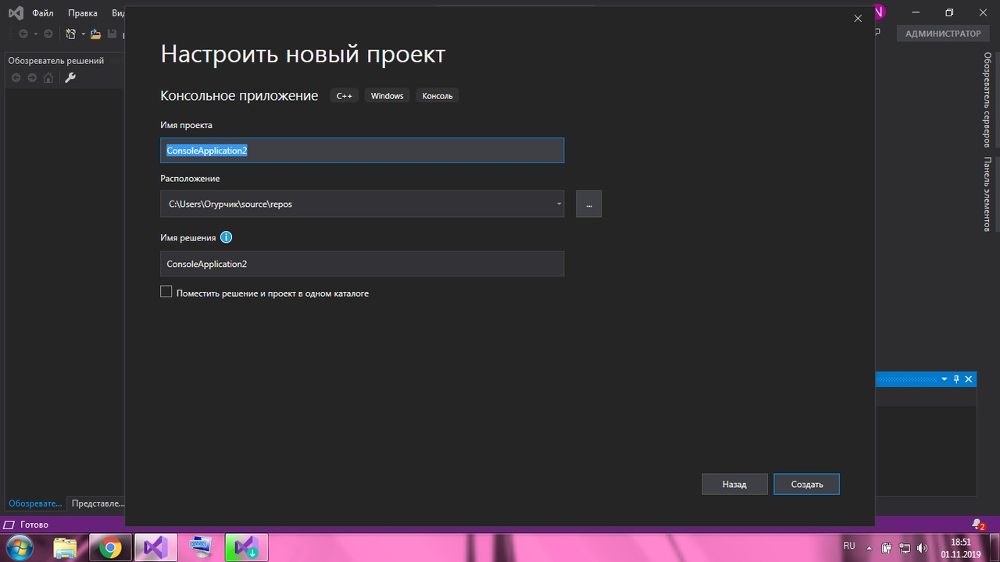
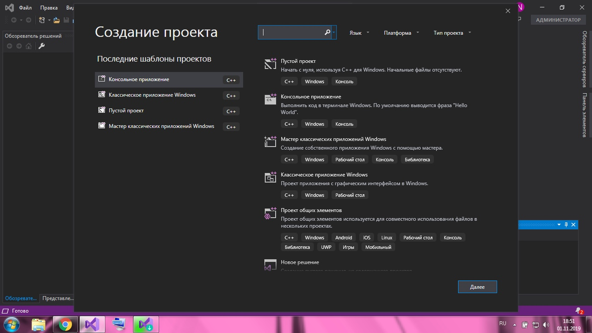
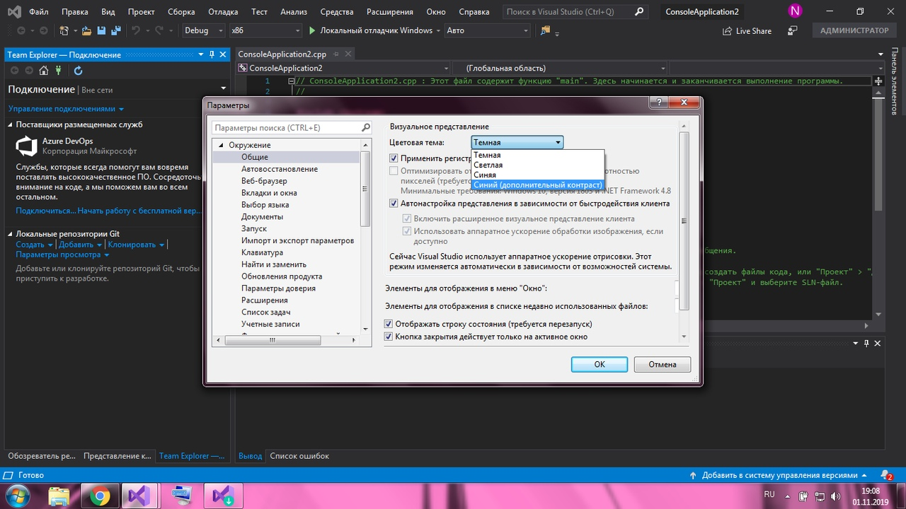
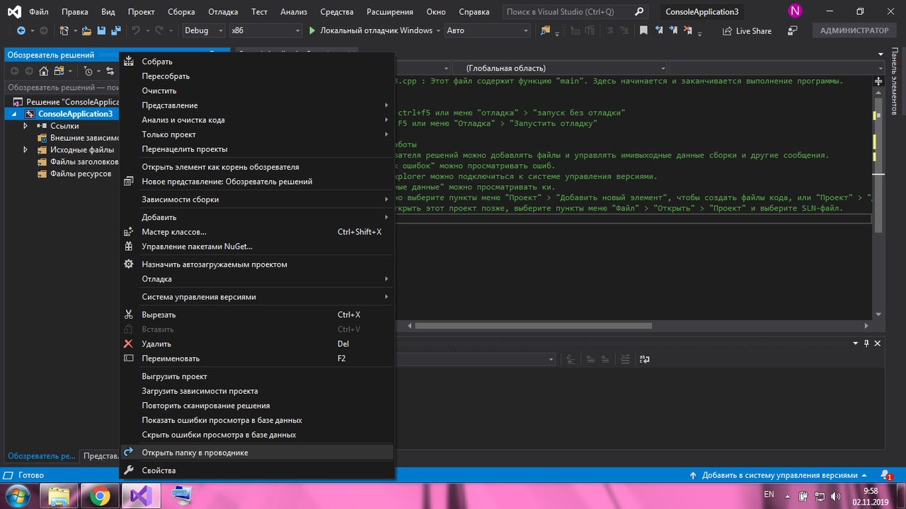
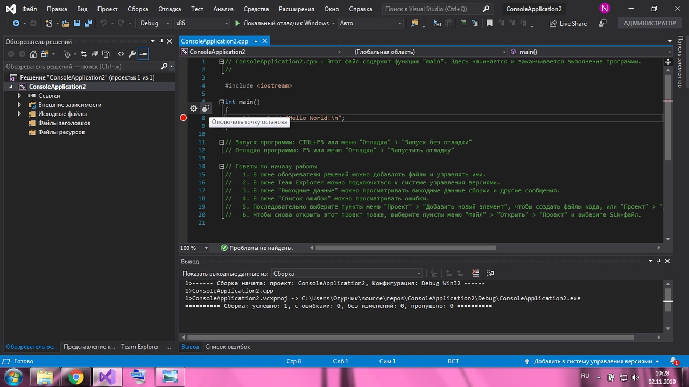

МИНИСТЕРСТВО НАУКИ  И ВЫСШЕГО ОБРАЗОВАНИЯ РОССИЙСКОЙ ФЕДЕРАЦИИ  
Федеральное государственное автономное образовательное учреждение высшего образования  
"КРЫМСКИЙ ФЕДЕРАЛЬНЫЙ УНИВЕРСИТЕТ им. В. И. ВЕРНАДСКОГО"  
ФИЗИКО-ТЕХНИЧЕСКИЙ ИНСТИТУТ  
Кафедра компьютерной инженерии и моделирования
  

### Отчёт по лабораторной работе № 1  по дисциплине "Программирование"
 

студента 1 курса группы 191(2)  
Селезневой Анны Владимировны  
направления подготовки 09.03.01 "Информатика и вычислительная техника"  
 

​

<table>

<tr><td>Научный руководитель  старший преподаватель кафедры  компьютерной инженерии и моделирования</td>

<td>(оценка)</td>

<td>Чабанов В.В.</td>

</tr>

</table>

  

​
Симферополь, 2019

#### Цель
 изучить основные возможности создания и отладки программ в IDE MS Visual Studio.
#### Ход работы
  
1. **Как создать консольное приложение С++;**
  
    * Нужно открыть `Файл`в меню и выбрать `Создать`,`Проект` (рис. 1). 

_(рис. 1)_

* Выбрать `Консольное приложение` и нажать `Далее` (рис. 2).
   
_(рис. 2)_

* Ввести имя проекта и нажать  `Создать`.

  
2. **Как изменить цветовую схему (оформление) среды;**
  
Нужно нажать `Средства`,`Параметры`и в открывшемся окне выбрать `Окружение`, `Общие`, выбрать параметр в строке `Цветовая схема`. (рис. 3).
   
_(рис. 3)_
  
3. **Как закомментировать/раскомментировать блок кода средствами VS;**
  
Для комментирования блока кода нужно выбрать строки которые надо комментировать и воспользоваться комбинацией `ctrl+k``ctrl+c`.
Для раскомментировани блока кода нужно выбрать строки которые надо раскоментировать и воспользоваться комбинацией `ctrl+k``ctrl+u`.
  
4. **Как открыть в проводнике Windows папку с проектом средствами VS;**
  
В обозревателе решений выбрать проект и в контекстном меню нажать `Открыть папку в проводнике`. (рис. 4).

    
_(рис. 4)_
  
5. **Какое расширение файла-проекта используется в VS;**
  
В VS для открытия проекта используется файл с расширением `sln`, который находится в папке каждого проекта.
  
6. **Как запустить код без отладки (не менее 2 способов);**
  
    * Запуск сочитанием клавиш `CTRL+F5`;
    * Запуск через меню `Отладка`,`Запуск без отладки`;
  
7. **Как запустить код в режиме отладки (не менее 2 способов);**
  
    * Запуск клавишей`F5`;
    * Запуск через меня `Отладка`,`Запустить отладку`;
  
8. **Как установить/убрать точку останова (breakpoint);**
  
Нажать слева от номера соответсвующей строки. В результате установится/уберется красная точка останова (рис.5).

    
    _(рис. 5)_
  
9. 
    * **Какое значение содержит переменная i в 5й строке?**
        Переменная i содержит значение `{int} 0`.
    * **Какое значение содержит переменная i в 6й строке?**
        Переменная i содержит значение `{int} 5`.
10. 
    * **Какое значение содержит переменная i в 5й строке?**
        Переменная i содержит значение `{double} 0`.
    * **Какое значение содержит переменная i в 6й строке?**
        Переменная i содержит значение `{double} 5`.
  

#### Ввывод
в ходе лабораторной работы были изучены основыне возможности и отладки программ в IDE Clion, как
* Создание консольных приложений;
* Возможность смены цветового оформления среды;
* Возможноть комментирования/раскомментирования кода;
* Возможность открыть требуемый файл в проводнике;
* Возможность открыть созданный ранее проект;
* Возможность запуска кода как с отладкой, так и без нее разными способами;
* Возможность устанавливать точки останова;
* Возможность узнавать значения переменных в ходе выполнения программой команд с точкой останова.
