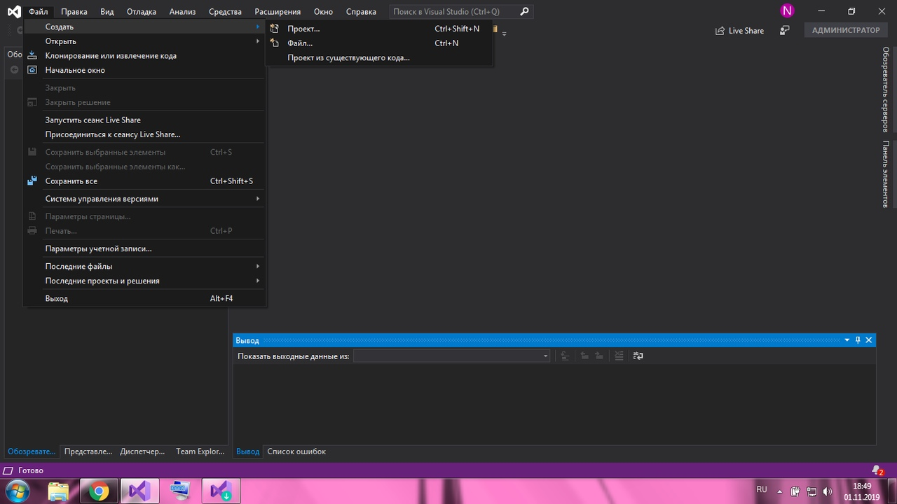

МИНИСТЕРСТВО НАУКИ  И ВЫСШЕГО ОБРАЗОВАНИЯ РОССИЙСКОЙ ФЕДЕРАЦИИ  
Федеральное государственное автономное образовательное учреждение высшего образования  
"КРЫМСКИЙ ФЕДЕРАЛЬНЫЙ УНИВЕРСИТЕТ им. В. И. ВЕРНАДСКОГО"  
ФИЗИКО-ТЕХНИЧЕСКИЙ ИНСТИТУТ  
Кафедра компьютерной инженерии и моделирования
  

### Отчёт по лабораторной работе № 1  по дисциплине "Программирование"
 

студента 1 курса группы 191(2)  
Селезневой Анны Владимировны  
направления подготовки 09.03.01 "Информатика и вычислительная техника"  
 

​

<table>

<tr><td>Научный руководитель  старший преподаватель кафедры  компьютерной инженерии и моделирования</td>

<td>(оценка)</td>

<td>Чабанов В.В.</td>

</tr>

</table>

  

​
Симферополь, 2019

#### Цель
 изучить основные возможности создания и отладки программ в IDE MS Visual Studio.
#### Ход работы
  
1. **Как создать консольное приложение С++;**
  
    * Нужно открыть `Файл`в меню и выбрать `Создать`,`Проект` (рис. 1). 
    
